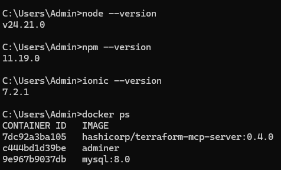
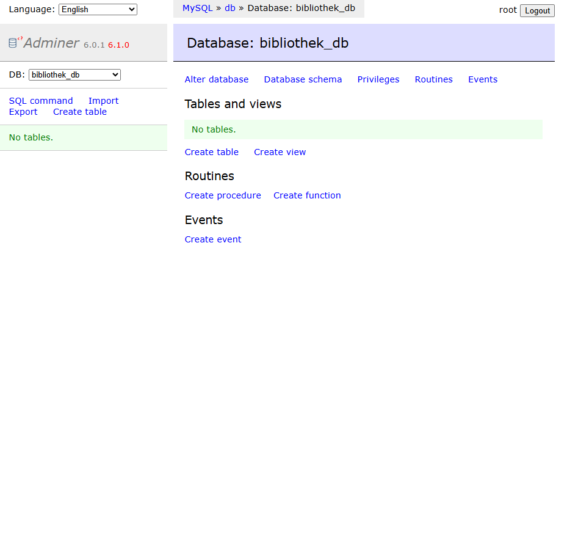

# Aufgabe 1: Installation und allgemeine Fragen

## Screenshots

### 1. Toolchain-Versionen / laufende Container
`docker ps` (MySQL + Adminer laufen via Docker):

### 2. DB-Tool mit leerer Datenbank
Adminer (`localhost:8080`), Server: `db`, Benutzer: `root`, Passwort: `geheim123`:

## Fragen

**Was ist der Unterschied zwischen Capacitor und Cordova?**

- beide packen Web-App in native Hülle
- Cordova
  - älter
  - Plugins teils veraltet

- Capacitor
  - neuer vom Ionic-Team,
  - besser gepflegt
  - einfacherer Zugriff auf native Projekte

**Was macht ein ORM wie Sequelize, und wofür braucht man zusätzlich die sequelize-cli?**

- ORM übersetzt JS-Objekte <-> SQL-Tabellen
- kein rohes SQL nötig
- sequelize-cli separates Tool nur für Migrationen und Model-Generierung

**Was unterscheidet npm install von npx beim Ausführen eines Pakets?**

- npm install installiert dauerhaft (lokal/global)
- npx führt einmalig aus, ohne dauerhafte Installation

**Was ist REST, und warum passt das Konzept zu einer Client-Server-Architektur wie Ionic-App und Node-Backend?**

- REST = Architekturstil für HTTP-APIs
- zustandslos
- Ressourcen über URLs
- Methoden (GET, POST, PUT, DELETE)
- Leicht wiederverwendbar weil Frontend/Backend getrennt sind und nur über HTTP-Requests kommunizieren
