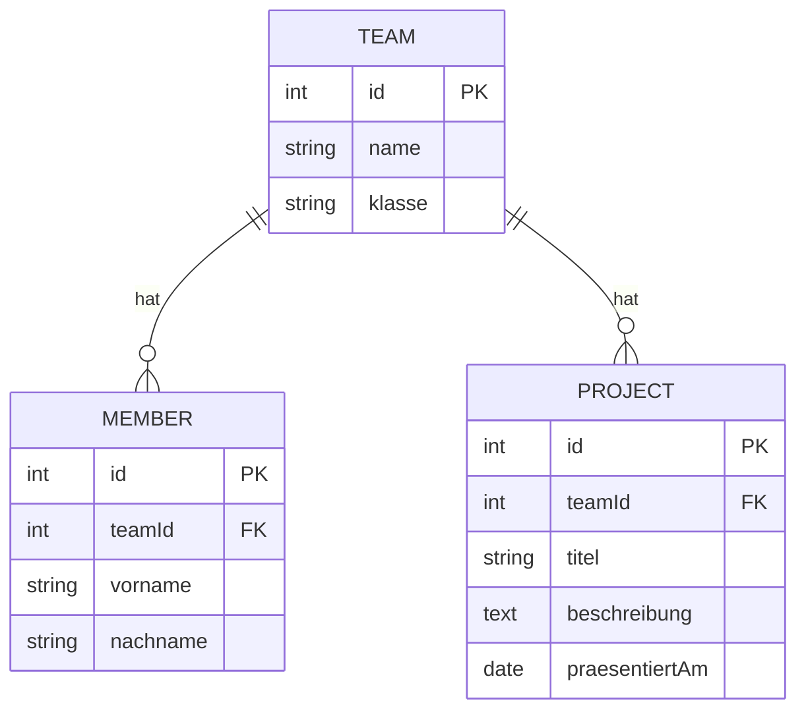
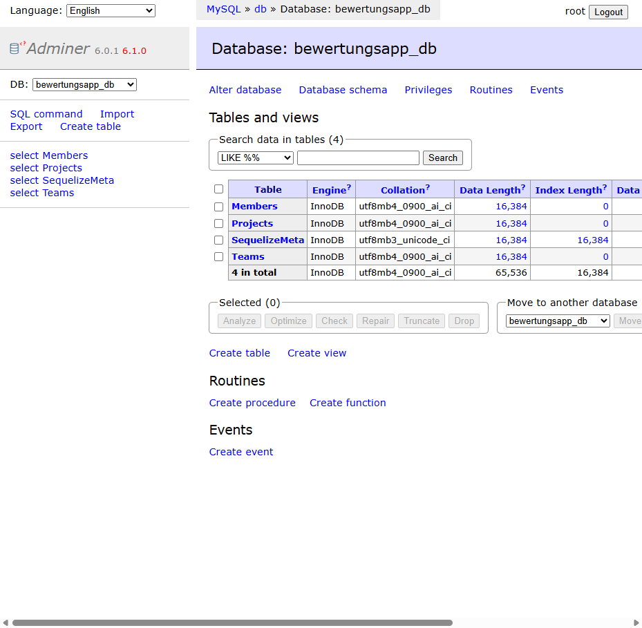

# Planungsvorlage: ER-Diagramm Bewertungsapp

Ausgefüllt für Aufgabe 2 (Team, Member, Project). Criterion, Juror und Evaluation folgen in Einheit 3.

## ER-Diagramm



## Team

| Spaltenname | Datentyp | Constraint |
|---|---|---|
| id | INTEGER | Primärschlüssel, automatisch |
| name | STRING | NOT NULL |
| klasse | STRING | NOT NULL |

**Beispieldaten**

| id | name | klasse |
|---|---|---|
| 1 | Team Blockchain | 4AHITL |
| 2 | Team RoboArm | 4AHITL |

## Member

| Spaltenname | Datentyp | Constraint |
|---|---|---|
| id | INTEGER | Primärschlüssel, automatisch |
| teamId | INTEGER | Fremdschlüssel → Team.id, NOT NULL |
| vorname | STRING | NOT NULL |
| nachname | STRING | NOT NULL |

**Beispieldaten**

| id | teamId | vorname | nachname |
|---|---|---|---|
| 1 | 1 | Lena | Huber |
| 2 | 1 | Tom | Novak |

## Project

| Spaltenname | Datentyp | Constraint |
|---|---|---|
| id | INTEGER | Primärschlüssel, automatisch |
| teamId | INTEGER | Fremdschlüssel → Team.id, NOT NULL |
| titel | STRING | NOT NULL |
| beschreibung | TEXT | optional |
| praesentiertAm | DATEONLY | NOT NULL |

**Beispieldaten**

| id | teamId | titel | beschreibung | praesentiertAm |
|---|---|---|---|---|
| 1 | 1 | Dezentrale Wahl-App | Abstimmungssystem auf Basis einer Blockchain | 2026-06-12 |
| 2 | 2 | Autonomer Greifarm | Robotikarm mit Bilderkennung | 2026-06-12 |

## Verwendete CLI-Befehle

```
cd backend
npm init -y
pnpm install express cors morgan sequelize cookie-parser mysql2
pnpm install -D sequelize-cli
npx sequelize-cli init
npx sequelize-cli db:create
npx sequelize-cli model:generate --name Team --attributes name:string,klasse:string
npx sequelize-cli model:generate --name Member --attributes teamId:integer,vorname:string,nachname:string
npx sequelize-cli model:generate --name Project --attributes teamId:integer,titel:string,beschreibung:text,praesentiertAm:dateonly
npx sequelize-cli db:migrate
```

Die `allowNull: false`-Constraints wurden danach manuell in den Migrations- und Model-Dateien ergänzt (per CLI-Attribut-Syntax nicht setzbar).

## Screenshot


